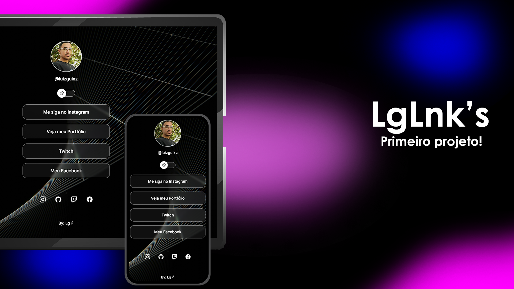
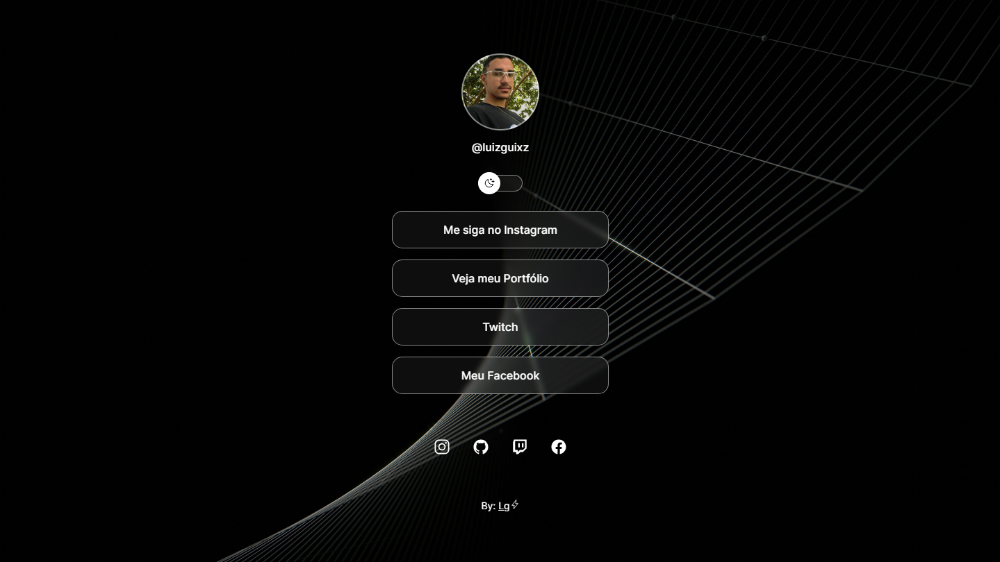

<h1 align="center"> LgLnk's </h1>

Feito com o programa exclusivo e gratuito, promovido pela Rocketseat para ensino de tecnologias WEB.  

  <a href="#-tecnologias">Tecnologias</a>&nbsp;&nbsp;&nbsp;|&nbsp;&nbsp;&nbsp;
  <a href="#-projeto">Projeto</a>&nbsp;&nbsp;&nbsp;|&nbsp;&nbsp;&nbsp;
  <a href="#-layout">Layout</a>&nbsp;&nbsp;&nbsp;|&nbsp;&nbsp;&nbsp;
  <a href="#memo-licença">Licença</a>

  

 

  

## 🚀 Tecnologias

Esse projeto foi desenvolvido com as seguintes tecnologias:

- HTML e CSS
- JavaScript
- Git e Github
- Figma

## 💻 Projeto

O Lg Links é um agregador de links para usar como cartão de visitas online, é o primeiro projeto em minha carreira! Foi feito com os conhecimentos adquiridos do curso EAD da [Rocketseat](https://www.rocketseat.com.br/discover).

## 🔖 Layout

Este é o layout do projeto!

  

## :memo: Licença

Esse projeto está sob a licença MIT.

---

By Luiz! :wave:
